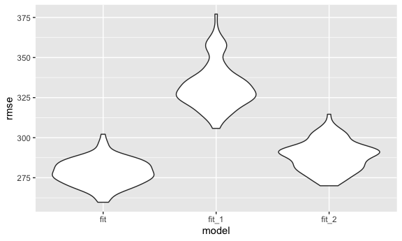
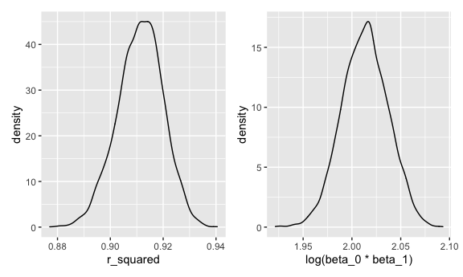

p8105\_hw6\_lcc2181
================

This code chunk loads packages to complete Homework 6, adds formatting
for plots, and sets a seed to ensure reproducibility.

``` r
library(tidyverse)
library(modelr)
library(purrr)
library(patchwork)

knitr::opts_chunk$set(
  fig.width = 6,
  fig.asp = .6,
  out.width = "90%"
)

set.seed(1)
```

## Problem 1

The following code chunk loads and cleans data for regression analysis.
Categorical variables (babysex, frace, malform, mrace) are converted
into factors. Furthermore, the resulting data frame is checked for
missing data. The output of this code shows that there are no missing
values.

``` r
birthweight_df =
  read_csv(file = "./data/birthweight.csv") %>% 
  mutate(
    babysex = as.factor(babysex),
    frace = as.factor(frace),
    malform = as.factor(malform),
    mrace = as.factor(mrace)
  )

birthweight_df %>% 
  is.na.data.frame() %>% 
  sum()
```

    ## [1] 0

The proposed regression model `fit` is based on a hypothesized
structured for factors associated with birthweight. Specifically, the
predictors included in the model were the following factors which may
underly birthweight: baby’s sex (babysex), baby’s length at birth
(blength), baby’s head circumference (bhead), mother’s age (momage),
mother’s race (mrace), gestational age (gaweeks), and number of
cigarettes smoked per day, on average, during pregnancy (smoken).

``` r
fit = lm(bwt ~ babysex + blength + bhead + momage + mrace + gaweeks + smoken, data = birthweight_df)
```

The following code chunk creates a scatter plot of residuals against
fitted values for the proposed regression model `fit`, using
`add_predictions` to obtain fitted values and `add_residuals` to obtain
residuals.

``` r
birthweight_df %>% 
  add_predictions(fit) %>% 
  add_residuals(fit) %>% 
  ggplot(aes(x = pred, y = resid)) + 
  geom_point() +
  labs(x = "Fitted Values", y = "Residuals")
```


Next, I compare my proposed regression model `fit` with two other models
in terms of cross-validated prediction error:

-   `fit_1`: Model using length at birth as well as gestational age as
    predictors
-   `fit_2`: Model using head circumference, length at birth, and sex
    (as well as all interactions between these variables) as predictors

To make this comparison, `crossv_mc` is used to perform multiple
training/testing splits. Furthermore, `map` is used to fit the models
and `map2_dbl` is used to obtain RMSEs.

``` r
cv_df =
  crossv_mc(birthweight_df, 100) %>% 
  mutate(
    train = map(train, as_tibble),
    test = map(test, as_tibble)
  ) %>% 
  mutate(
    fit = map(train, ~lm(bwt ~ babysex + blength + bhead + momage + mrace + gaweeks + smoken, 
          data = .x)),
    fit_1 = map(train, ~lm(bwt ~ blength + gaweeks, data = .x)),
    fit_2 = map(train, ~lm(bwt ~ bhead + blength + babysex + bhead * blength + bhead * babysex 
          + blength * babysex + bhead * blength * babysex, data = .x)),
  ) %>% 
  mutate(
    rmse_fit = map2_dbl(fit, test, ~rmse(model = .x, data = .y)),
    rmse_fit_1 = map2_dbl(fit_1, test, ~rmse(model = .x, data = .y)),
    rmse_fit_2 = map2_dbl(fit_2, test, ~rmse(model = .x, data = .y))
  )
```

The plot below displays the distribution of RMSE values for each of the
three models (`fit`, `fit_1`, and `fit_2`):

``` r
cv_df %>% 
  select(rmse_fit, rmse_fit_1, rmse_fit_2) %>% 
  pivot_longer(
    everything(),
    names_to = "model",
    values_to = "rmse",
    names_prefix = "rmse_"
  ) %>% 
  ggplot(aes(x = model, y = rmse)) +
  geom_violin()
```



Based on this plot, the model I proposed (`fit`) performs better than
the other two models (`fit_1` and `fit_2`).

## Problem 2

The code chunk below downloads 2017 Central Park weather data.

``` r
weather_df = 
  rnoaa::meteo_pull_monitors(
    c("USW00094728"),
    var = c("PRCP", "TMIN", "TMAX"), 
    date_min = "2017-01-01",
    date_max = "2017-12-31") %>%
  mutate(
    name = recode(id, USW00094728 = "CentralPark_NY"),
    tmin = tmin / 10,
    tmax = tmax / 10) %>%
  select(name, id, everything())
```

The code chunk below draws 5,000 bootstrap samples using the `bootstrap`
function. After fitting a simple linear regression model with tmax as
the outcome variable and tmin as the predictor variable,
`broom::glance()` is utilized to extract the estimated r-squared for
each bootstrap sample. Furthermore, `broom::tidy()` is utilized to
extract the term (intercept or tmin) and associated parameter estimate
for each bootstrap sample. I used `pivot_wider` to transform the output
such that the parameter estimates for the intercept and tmin were
variables in a resulting data frame with 5,000 observations; after
transforming the data in this way, I computed log(beta\_0 \* beta\_1)
for each bootstrap sample.

``` r
bootstrap_results = 
  weather_df %>% 
  bootstrap(n = 5000) %>% 
  mutate(
    models = map(strap, ~lm(tmax ~ tmin, data = .x)),
    results_1 = map(models, broom::glance),
    results_2 = map(models, broom::tidy)
  ) %>% 
  select(results_1, results_2) %>% 
  unnest(results_1, results_2) %>% 
  select(r.squared, term, estimate) %>% 
  pivot_wider(
    names_from = "term",
    values_from = "estimate"
  ) %>% 
  janitor::clean_names() %>% 
  mutate(log_beta0_beta1 = log(intercept*tmin)) %>% 
  select(-intercept, -tmin)
```

    ## Warning: unnest() has a new interface. See ?unnest for details.
    ## Try `df %>% unnest(c(results_1, results_2))`, with `mutate()` if needed

The plot below shows the distribution of estimates for r-squared and
log(beta\_0 \* beta\_1).

``` r
plot_1 =
  bootstrap_results %>% 
  ggplot(aes(x = r_squared)) +
  geom_density()

plot_2 =
  bootstrap_results %>% 
  ggplot(aes(x = log_beta0_beta1)) +
  geom_density() +
  labs(x = "log(beta_0 * beta_1)")

plot_1 + plot_2
```



The distribution of estimates for r-squared is slightly left-tailed. The
estimates for log(beta\_0 \* beta\_1) seem to be relatively normally
distributed.

The following code chunk identifies 2.5% and 97.5% quantiles for
r-squared and log(beta\_0 \* beta\_1).

``` r
bootstrap_results %>%
  summarize(
    ci_rsquared_lower = quantile(r_squared, 0.025),
    ci_rsquared_upper = quantile(r_squared, 0.975)
  )
```

    ## # A tibble: 1 × 2
    ##   ci_rsquared_lower ci_rsquared_upper
    ##               <dbl>             <dbl>
    ## 1             0.894             0.927

``` r
bootstrap_results %>%
  summarize(
    ci_log_beta0_beta1_lower = quantile(log_beta0_beta1, 0.025),
    ci_log_beta0_beta1_upper = quantile(log_beta0_beta1, 0.975)
  )
```

    ## # A tibble: 1 × 2
    ##   ci_log_beta0_beta1_lower ci_log_beta0_beta1_upper
    ##                      <dbl>                    <dbl>
    ## 1                     1.97                     2.06

Based on this output, the 95% confidence intervals for r-squared and
log(beta\_0 \* beta\_1) are:

-   95% CI for r-squared: (0.89, 0.93)
-   95% CI for log(beta\_0 \* beta\_1): (1.96, 2.06)
